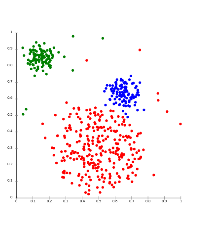
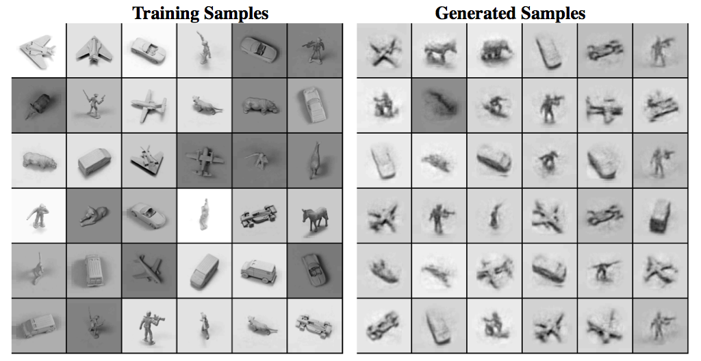
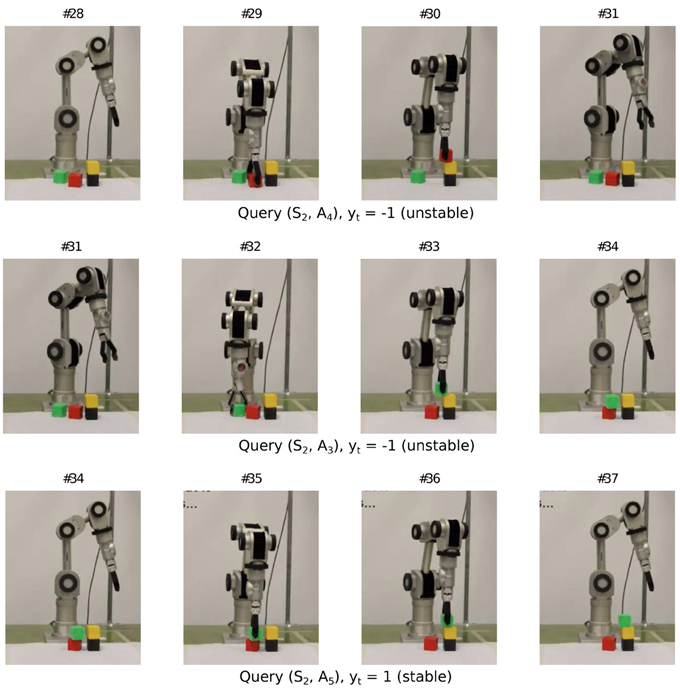

% Ignoring What's Boring
% Chris Warburton, University of Dundee
% http://chriswarbo.net chriswarbo@gmail.com

## Blue Sky Goal

How much of programming can we automate?

 - Lots of work done on code *generation*
 - What can we do with *existing* code?
    - Abstraction
    - Simplification
    - Optimisation
    - **Understanding**
    - ...

## Theory Exploration

Given definitions $d_1, d_2, ..., d_n$, what can we prove?

\begin{exampleblock}{Example}\end{exampleblock}

Haskell functions `+`{.haskell}, `-`{.haskell}, `*`{.haskell}, `1`{.haskell}, `0`{.haskell}, `x :: Int`{.haskell}, `y :: Int`{.haskell}, `z :: Int`{.haskell}

. . .

\begin{align*}
          0 + 0 &= 0 \\
      0 + 0 + 0 &= 0 \\
  0 + 0 + 0 + 0 &= 0
\end{align*}

Oops!

## Ignoring What's Boring

Given prior results, *classify* new theorems as "interesting" or not:

```haskell
interestingGiven :: Theorem -> [Theorem] -> Bool
```

Theory exploration is *function inversion*: find `t`{.haskell} such that

```haskell
t `interestingGiven` prior == True
```

## Ignoring What's Boring: Intuition

 - "Simple" theorems are more interesting than "complicated" ones
 - "Trivial" theorems are boring
 - "Surprising" theorems are interesting
 - "Useful" theorems are interesting
 - *Analogous* theorems are interesting (theorems about `NonEmptyList`{.haskell} should probably look similar to existing theorems about `List`{.haskell}).

## Function Inversion

 - Classic AI/Machine Learning problem
 - Two sub-problems:
    - Which function to invert (what is interesting/boring?)
    - Which search strategy?

## Existing Approaches

 - QuickSpec (1)
    - "Boring" := derivable from congruence closure relation
    - Search by brute-force enumeration, filtered by random counter-examples
 - HipSpec
    - "Interesting" := QuickSpec find it interesting, and HIP can prove it
    - Uses QuickSpec for search
 - Hipster
    - "Interesting" := requires induction to prove (configurable)
    - Uses HipSpec for search
 - IsaCoSy
    - "Boring" := reducible via rewrite
    - Search by brute-force enumeration with constraints

## Existing Approaches

Pros:

 - Exhaustive
 - Repeatable
 - Focuses on simplicity

Cons:

 - Doesn't scale to large numbers of functions
 - Hard-coded definition of "interesting", chosen for ease of inversion

## Reasoning By Analogy

\

Source: Wikimedia

## Reasoning By Analogy: Overview

 - *Cluster* symbols together based on similarity of definition
    - `c1 = [+, ++, *, ..]`{.haskell}
    - `c2 = [[], 0, Nothing, ..]`{.haskell}
    - `c3 = [Just, Succ, Left, Right, ..]`{.haskell}
    - ...
 - Existing theorems induce schemas, where symbols become cluster IDs:
    - `(+) x 0 = x`{.haskell} $\rightarrow$ `c1 x c2 = x`{.haskell}
 - Instantiate schemas to make candidate formulas:
    - `(+) x [] = x`{.haskell}, `(++) x 0 = x`{.haskell}, `(*) x [] = x`{.haskell}, `(++) x [] = x`{.haskell}, ...
 - Search around these to find theorems

## Reasoning By Analogy: Recurrent Feature Extraction

```haskell
all x y z = if x
               then y && z
               else False
```

## Reasoning By Analogy: Recurrent Feature Extraction

```
       if
       |
   +---+---+
   |   |   |
   x   &&  False
       |
    +--+--+
    |     |
    y     z
```

## Reasoning By Analogy: Recurrent Feature Extraction

+----+----+-------+
| if |    |       |
+----+----+-------+
| x  | && | False |
+----+----+-------+
| y  | z  |       |
+----+----+-------+

## Reasoning By Analogy: Recurrent Feature Extraction

+----+----+----+
| cA | 0  | 0  |
+----+----+----+
| 1  | cB | cC |
+----+----+----+
| 2  | 3  | 0  |
+----+----+----+

## Future ML Directions

Many Machine Learning approaches seem promising to investigate

## Future ML Directions: Multi-Armed Bandits

\


## Future ML Directions: Multi-Armed Bandits

Iteratively choose which slot machine to play, from $\{S_1, .., S_n\}$

 - Different machines have different payoffs
 - Exploration vs exploitation
 - Fundamental resource allocation problem
 - Which arm to pull := which symbols to explore

## Future ML Directions: Data Mining

\


## Future ML Directions: Data Mining

Can we analyse existing code to predict what humans find interesting?

 - Haskell test suites contain equational properties
 - Haskell functions are defined equationally
    - We want to provide insight *on top* of the raw definitions
 - Problem: These are only *positive* examples
    - We don't know what authors *didn't* write

## Future ML Directions: Generative Models

\

http://www.metacademy.org/roadmaps/rgrosse/deep_learning

## Future ML Directions: Generative Models

 - Bi-directional model of computation: learning `A -> B`{.haskell} gives us `B -> A`{.haskell}
 - Learning what's interesting lets us *produce* what's interesting
 - Learning similarities lets us *produce* similar definitions
 - Examples: Auto-encoders, Deep Belief Networks, Baysian Networks, Probabalistic Programming

## Future ML Directions: Artificial Curiosity

\

http://people.idsia.ch/~ngo/ijcnn2012/katana_curiosity.html

## Future ML Directions: Artificial Curiosity

Information-theoretic formalisation of "interesting". "Reward" searcher using:

 - Disagreement between outcome and prediction (surprise)
 - Improvement made in prediction (learning)
 - Time derivatives of observation compressibility

Meta-level algorithm: biases an underlying search.

## Summary

 - Theory Exploration is an aid to theory/software understanding
 - Existing approaches rely on brute-force
    - Natural fit for AI
 - Notion of "interesting" is fuzzy
    - Natural fit for ML
 - Lots of promising approaches
